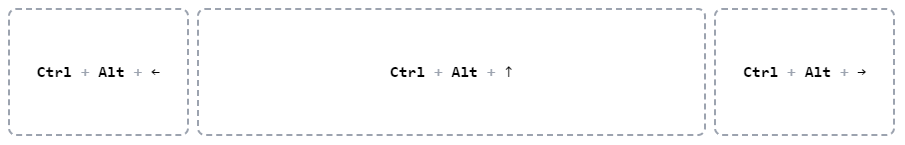

# move-focused-window
Small program to place any current focused window to the center, left or right of the screen

## Installation

`make && make install` <- will copy the binary to `/usr/local/bin/move_focused_window`

## Creating Keyboard shortcuts

#### Linux
Open Keyboard settings and create a custom keyboard shortcut, for example `win+c` to execute `/usr/local/bin/move_focused_window`.

#### Windows

Windows do not allow create custom keyboard so easily, but using this application allows you create custom scripts to create custom keyboard shortcuts.

Download [https://www.autohotkey.com/](https://www.autohotkey.com/), create a new file script with `ahk` extension, for example `C:\KeyboardShortcuts\MoveFocusedWindow.ahk`, here's a little example:

```
^#Up::
{
    RunWait "C:\Bin\move_focused_window.exe", , "Hide"
}

^#Left::
{
    RunWait "C:\Bin\move_focused_window.exe --left --width 960", , "Hide"
}

^#Right::
{
    RunWait "C:\Bin\move_focused_window.exe --right --width 960", , "Hide"
}
```

Save it and double click the script to activate the custom shortcut.

#### Arguments

|Command| Description  |
|--|--|
| `--left` | The window will be place to the left side of the screen |
| `--right` | The window will be place to the right side of the screen |
| `--width [n]` | Define the width to resize the window |
| `--height [n]` | Define the height to resize the window |


#### Examples

`> move_focused_window --left` The window will be placed half of the screen to the left side.

`> move_focused_window --right` The window will be placed half of the screen to the right side.

 `> move_focused_window` The window will be placed in the center of the screen with half size.

 `> move_focused_window --right --width 600 --height 1080` The window will be moved to the right side of the screen, resizing it to `600x1080`.


#### Default behaviour



## To Do
- Merge **`--left`** and **`--right`** commands to: `--left [n]` allowing move the window to an **X** point.
- Add `--top [n]` allowing move the window to a **Y** point.